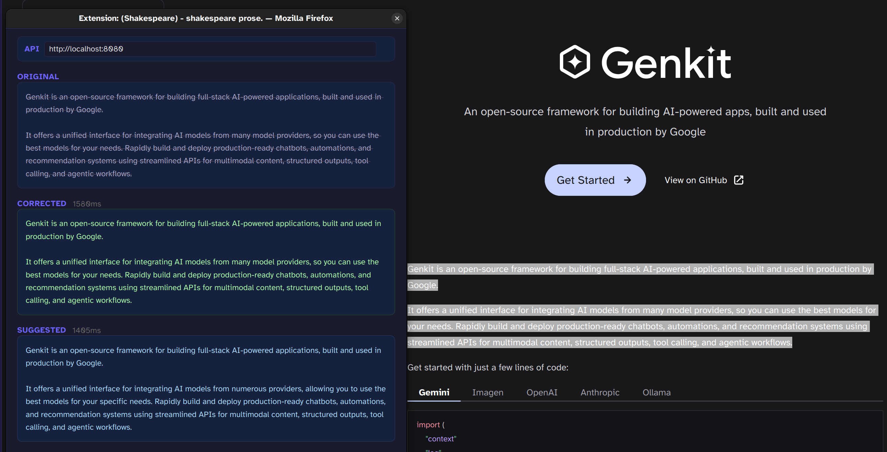

# shakespeare-extension

manipulate selected text from contextual menu for grammatical correction and improvement.

## disclaimer

- coded with an LLM, adjusted, refactored, verified by hand.
- only my own usage in mind.
- inspired by [https://github.com/ProtonMail/WebClients/tree/main/applications/pass-extension](https://github.com/ProtonMail/WebClients/tree/main/applications/pass-extension)
